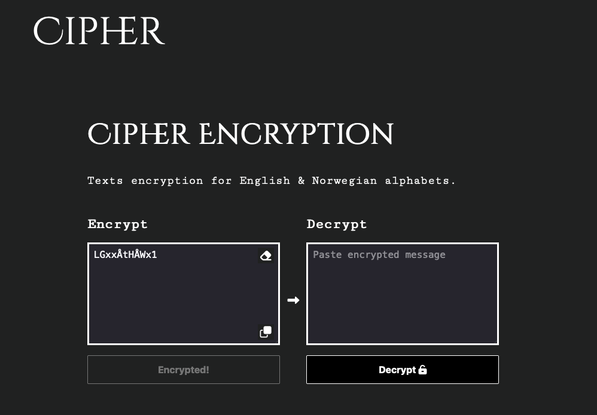

# Cipher

https://cipher.kimuramegumi.site/



## Brief

Cipher is an interface where users can encrypt/decrypt a message.
Personal mini project.

## Built With

- HTML
- CSS
- JS

## Getting Started

### Installing

1. Clone the repo:

```bash
git clone https://github.com/MegumiKim/Cipher.git
```

## Contact

Any issues / feedback, reach me on kimuramegumi@gmail.com
